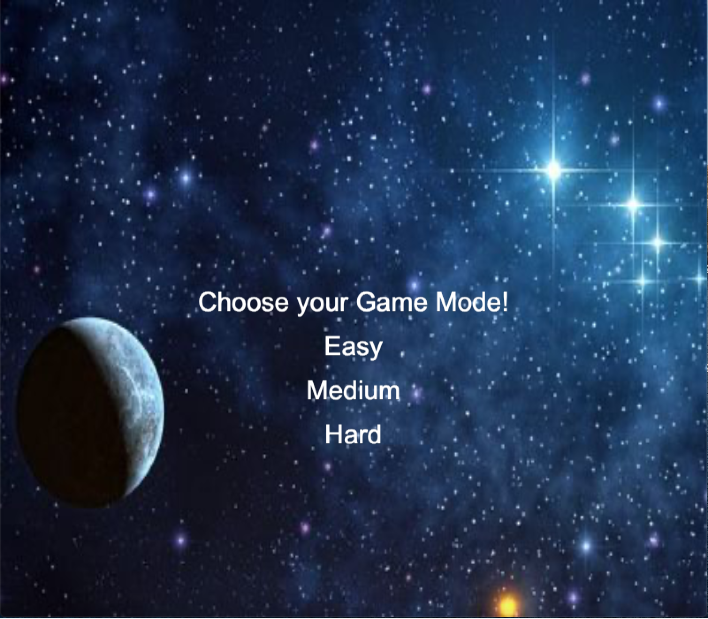
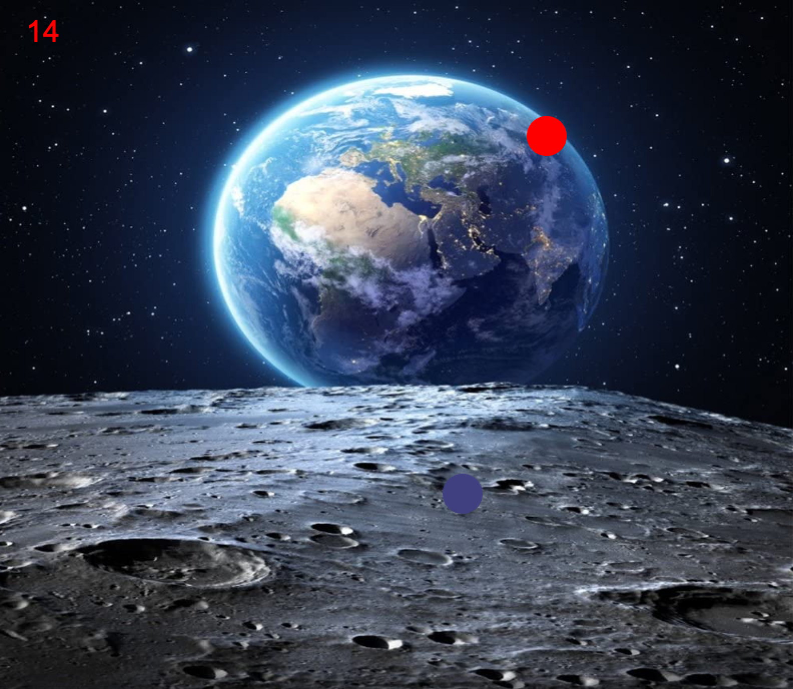

# Quick Click Final Project

Read [this document](https://cliutils.gitlab.io/modern-cmake/chapters/basics/structure.html) to understand the project
layout.

**Author**: Chandrachur Kesana - [`ckesan2@illinois.edu`](mailto:ckesan2@illinois.edu)

**Quick Click**:
- 

* What is it? 

   - It is a game for users to click on moving objects for
    points with a time limit. 
    
   - Includes three different game modes 
   
   - Keeps a leader board for each difficulty
   
   - Includes two potion items that speed and slow 
   object movement.
 
   - Makes use of the Cinder, [gflags](https://github.com/gflags/gflags),
   [SQLiteModernCpp](https://github.com/SqliteModernCpp/sqlite_modern_cpp),
    and SQLite3 libraries
    
   
Here is an example of the screen during game play:

---
**Installation:**
- 

    - This is a Cmake Project. Cmake is necessary to 
    have installed!
    
    - The Cinder Library is also required to be installed.

**Cinder**:
- 

- To download Cinder onto your machine, click 
[here](https://libcinder.org/download).

- **Important!!!**: For Windows Users, specifcally
Visual Studio 2015 is needed to download Cinder properly.

- Once Cinder is downloaded, extract the zip into 
a folder. Open the Cinder folder in your IDE and
click the build button to build libcinder. This only
needs to be done once.

- In the downloaded directory, add a new directory
called my-projects. In that my-projects directory,
create a new directory called quick-click and clone
the project into the quick-click directory.

- [Here](https://libcinder.org/docs/guides/tour/hello_cinder_chapter1.html) 
is a basic tutorial on how Cinder works.

- Here is some Cinder 
[documentation](https://libcinder.org/docs/reference/index.html) 
on classes and utilities.

- _Quick Click_ specifically utilizes Texture2d for loading images
 and the [Voice](https://libcinder.org/docs/guides/audio/index.html) API
 for background music

- Furthermore, a huge aspect of this project is recognizing
mouse clicking with the use of Cinder. Here is 
documentation on the [mouse](https://libcinder.org/docs/guides/tour/hello_cinder_chapter3.html) 
methods.

**SQLite**: 
- 

- There is no need to install the 
[SQLiteModernCpp](https://github.com/SqliteModernCpp/sqlite_modern_cpp)
and SQLite3 libraries because they are already included
in the CMakeLists.txt file and added as dependencies.

- These libraries are used to create queries to 
create the leader board tables and display the 
top scores at the end of the game.

**GFlags**:
- 

- This project uses the gflags library to parse the 
command line arguments.

- To change the name of player in your IDE 
in the command line arguments, go to: 

        Edit Configurations -> Program Arguments and type
        in the name using this format: 
    
        "--name=Jordan"

---