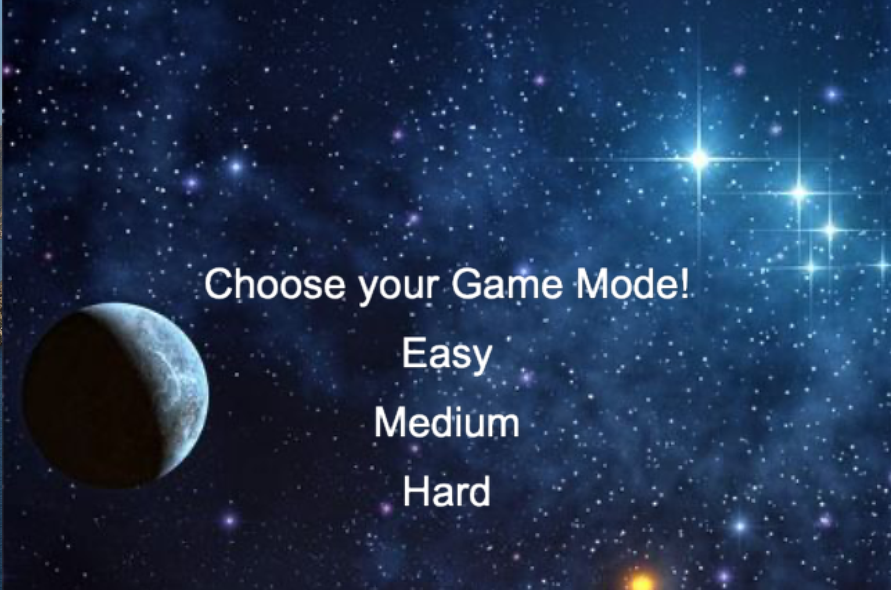

# Quick Click Final Project

Read [this document](https://cliutils.gitlab.io/modern-cmake/chapters/basics/structure.html) to understand the project
layout.

**Author**: Chandrachur Kesana - [`ckesan2@illinois.edu`](mailto:ckesan2@illinois.edu)

